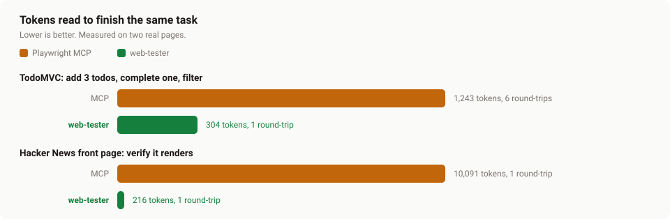
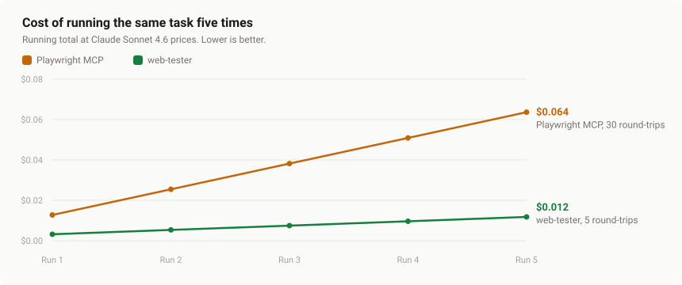

# web-tester-for-claude

Let your coding agent see and verify the web changes it makes. web-tester drives
your dev site in a real browser, captures everything to one report, and runs a
whole flow in a single model turn instead of a dozen back-and-forth tool calls.

It records every console line, network request, page error, and screenshot (plus
the video and full DOM if you want them) into one self-contained HTML report and
one `result.json` per run. The agent reads back only the parts it needs, so the
edit, verify, repeat loop stays cheap and fast even across many steps.

It is a toolkit, not a pipeline. There is no LLM stage, no test generation, and
no judging. You, or an agent like Claude Code, decide what to look at. web-tester
just makes it cheap to look.

**Contents**

- [Why a CLI, not an MCP server](#why-a-cli-not-an-mcp-server): the cost case, with measured numbers
- [Install](#install), [Quick start](#quick-start), and [Commands](#commands)
- [Setup](#setup) and [Mapping a site](#mapping-a-site)
- [Step grammar](#step-grammar), [Assertions](#verdict-and-assertions), and [Deeper capture](#deeper-capture)
- [Devices](#devices): run any flow on mobile, tablet, or desktop
- [Authentication](#authentication), [Project config](#project-config), and [Report shape](#report-shape)

```bash
# Quick verify a change. Fail on any 5xx, assert text is visible, in about 6s.
npx web-tester-for-claude inspect "/products/widget" \
  --step settle --quick \
  --expect "text=Add to Cart" \
  --fail-on http-5xx

# Drive a flow, capture state at every step.
npx web-tester-for-claude inspect "/products/widget" \
  --step settle \
  --step screenshot:initial \
  --step "click:button:has-text(\"Add to Cart\")" \
  --step wait:networkidle \
  --step goto:/cart \
  --step screenshot:cart

# Check many URLs in parallel.
npx web-tester-for-claude sweep --sitemap --filter '^/products/' --concurrency 4 \
  --fail-on http-5xx
```

---

## Why web-tester

You can drive Playwright yourself. web-tester is worth it for three reasons that
show up every day:

1. **One report on disk.** Each run captures everything to `.web-tester/runs/<id>/`,
   and the CLI prints the path to a self-contained `report.html`. An agent reads
   `result.json` selectively (`jq '.steps[3].network'`) instead of pulling every
   byte of browser state back into the conversation. For "reproduce this bug and
   tell me what happened" tasks, that is a fraction of the tokens.
2. **One step grammar.** No heredoc Playwright scripts to maintain.
   `--step click:…`, `--step fill:…=…`, `--step wait:url-contains:…`. Composable,
   copy-pasteable from a recipe, no boilerplate.
3. **Knowledge travels with the repo.** Drop project quirks into
   `.web-tester/instructions/*.md` and any future session, yours or the agent's,
   gets them as a warm start instead of rediscovering them.

The HTML report has a sticky video player with speed presets, a step timeline
with screenshot and console/network slices, lightboxed full-page screenshots,
and collapsible global logs. Open it first; the JSON is for programmatic reads.

---

## Why a CLI, not an MCP server

[Microsoft's Playwright MCP](https://github.com/microsoft/playwright-mcp) is
great for live, interactive browser control, where the agent decides each click
as it goes. web-tester is deliberately a CLI instead, because a coding agent's
job is not to click around live. It is to verify a change it just made, over and
over, per project. A CLI fits that in three ways an MCP server cannot:

- **It learns the project over time.** Everything lives in `.web-tester/`:
  recipes, instructions, a route map, journeys. It grows as you use it, so the
  next session gets a warm start instead of rediscovering your site. An MCP
  server is stateless per project and remembers nothing between runs.
- **It produces artifacts.** One run writes a self-contained `report.html` (video
  plus step timeline) and a `result.json` you can diff, attach to a PR, or hand
  to CI. MCP returns everything into the conversation, and then it is gone.
- **It barely touches context.** MCP returns a full page snapshot into the
  conversation on every step, and those tokens pile up and never leave.
  web-tester runs the whole flow in one process and hands back a compact verdict.
  The agent reads `result.json` slices only if it needs them.

### Measured: tokens, round-trips, and cost

The same task, run each way, counting what enters the model's context, the model
round-trips, and the dollar cost ([methodology](#methodology)):



| Task | Tool | Input tokens | Output tokens | Round-trips | Cost per run | Per 1,000 runs |
|---|---|--:|--:|--:|--:|--:|
| TodoMVC (add 3, complete 1, filter) | Playwright MCP | ~1,240 | ~600 | 6 | $0.013 | $12.70 |
| | web-tester | ~300 | ~150 | 1 | $0.003 | $3.16 (4x less) |
| Hacker News (verify front page) | Playwright MCP | ~10,100 | ~100 | 1 | $0.032 | $31.80 |
| | web-tester | ~220 | ~150 | 1 | $0.003 | $2.90 (11x less) |

Cost is at Claude Sonnet 4.6 list price ($3 and $15 per million input and output
tokens). It scales with whatever model you run (about 1.7x at Opus 4.8 rates).
Input tokens are measured; output is a modest per-round-trip estimate.

Two honest caveats. Raw browser time is comparable, because both use the same
engine; the time that matters is model round-trips, not browser speed. And these
numbers under-count MCP: we reproduced its payload with Playwright's aria
snapshot, which omits the per-node `[ref]` metadata MCP also sends, and we count
each context token once (a real agent loop re-sends the growing context every
turn, so MCP's snapshots get re-billed; prompt caching offsets some of that). The
single Hacker News snapshot alone is about 10k tokens.

### It compounds on reruns

The bigger win is not the first run. It is the second. Playwright MCP has no
project memory, so every rerun re-explores the page from scratch at full cost.
web-tester saves the flow on the first run (`inspect … --save-journey todomvc`)
as a roughly 500-byte plain-text recipe: just the URL, the steps, and the
assertions. Not HTML, not snapshots. The big `report.html` and video stay in the
disposable `runs/` folder and are never reused. Every rerun is then one command
(`web-tester journey todomvc`) that replays those steps live. So the cost gap
widens with every repeat:



| Tool | Run 1 (fresh) | Each rerun | Cost after 5 runs |
|---|---|---|---|
| Playwright MCP | $0.013, 6 round-trips | $0.013, 6 round-trips | $0.064, 30 round-trips |
| web-tester | $0.003, 1 round-trip (saves the journey) | $0.002, 1 round-trip | $0.012, 5 round-trips |

That is the point of a per-project CLI: it accumulates. Recipes, journeys, and
the route map become the project's test memory, so the agent does the expensive
exploration once and replays it for free, while a stateless MCP server pays full
price every time.

The two pair well; they do not compete. Use Playwright MCP for open-ended,
exploratory clicking. Use web-tester to verify changes cheaply, check many pages,
and build the project's test memory. web-tester can even hand MCP a logged-in
session (its saved storage state) when you want to drive an authenticated app by
hand.

<sub><a name="methodology"></a>Methodology: tasks run against
`demo.playwright.dev/todomvc` and `news.ycombinator.com`, June 2026. MCP input is
the accessibility snapshot returned per action (captured with Playwright's
`ariaSnapshot()` on the same live pages); web-tester input is the CLI's printed
summary; a rerun is `web-tester journey todomvc` against a saved journey. Output
tokens are a modest per-round-trip estimate. Dollar cost uses Claude Sonnet 4.6
list pricing ($3 and $15 per million input and output). Tokens are estimated as
characters divided by 4. Benchmark: [`docs/bench.js`](docs/bench.js); charts:
[`docs/make-charts.js`](docs/make-charts.js).</sub>

---

## Install

```bash
npx web-tester-for-claude help          # zero-install, runs the latest from npm
```

Or add it as a project dev dependency so the version is pinned:

```bash
npm install -D web-tester-for-claude
npx web-tester-for-claude help
```

A global install works too (`npm install -g web-tester-for-claude`, then run
`web-tester`). The first run fetches Playwright's Chromium binary if it is not
already on disk; you can do that explicitly with `npx playwright install chromium`.

---

## Quick start

```bash
# 1. Interactive setup. Scaffolds .web-tester/, writes a Claude Code skill and a
#    CLAUDE.md section, and saves your base URL. A bare `npx web-tester-for-claude`
#    on a fresh project runs this for you.
npx web-tester-for-claude init

# 2. Start your dev server.
npm run dev    # whatever your dev command is

# 3. Map the running site. Generates a preset, recipes, and journey drafts.
npx web-tester-for-claude map

# 4. Verify a single URL works end to end.
npx web-tester-for-claude inspect / \
  --step settle --quick \
  --expect "selector=main" \
  --fail-on http-5xx
```

The CLI prints the absolute path to `report.html` at the end of every run, so you
can open it in a browser. Run artifacts land in `.web-tester/runs/` in your
project (override with `WEB_TESTER_RUNS_DIR`).

---

## Commands

| Command | What it does |
|---|---|
| `init` | Scaffold `.web-tester/` and wire the agent-instructions section into your `CLAUDE.md` or `AGENTS.md`. Run once per project. |
| `map` | Crawl your running site, classify every page, and generate a sweep preset, smoke recipes, and form journey drafts. |
| `inspect <url>` | Drive one page, optionally with `--step …`, and capture everything. |
| `sweep` | Run inspect concurrently across many URLs (one Chromium, N contexts). |
| `journey <name>` | Run a saved JSON journey from `.web-tester/journeys/<name>.json`. |
| `journey` (no arg) | List available journeys. |
| `impact` | Diff-aware advisory run. Matches changed files against rules in `.web-tester/impact-rules.json` and runs the indicated sweeps or journeys. Always exits 0. |
| `kb` / `kb <topic>` | List or print a `.md` file in `.web-tester/instructions/` (or `.web-tester/`). |
| `help` | Full reference. |

Every command targets `http://localhost:3000` by default. Point at anything else
with `WEB_TESTER_BASE_URL=…`.

---

## Setup

The first time you run web-tester in a project, it drops into an interactive
setup. You can also run it explicitly any time:

```bash
npx web-tester-for-claude          # first run, guided setup
npx web-tester-for-claude init     # or run setup explicitly
```

It asks a few questions, each with a sensible default you can accept by pressing
Enter: your dev server base URL, which agent file to write, how eagerly Claude
should reach for web-tester, whether to generate a Claude Code skill, and whether
to install Chromium now. Then it writes:

- `.web-tester/` with a starter `impact-rules.json`, `urls-smoke.txt`, an example
  journey, `instructions/` recipes, and a `config.json` holding your base URL (so
  commands work without setting `WEB_TESTER_BASE_URL`). Run artifacts go in
  `.web-tester/runs/`, gitignored automatically.
- `.claude/skills/web-tester/SKILL.md`, a [Claude Code
  skill](https://docs.claude.com/en/docs/claude-code/skills) so Claude can drive
  web-tester natively (it is auto-invoked for runtime-behavior questions, or on
  demand with `/web-tester`), with the right `Bash(npx web-tester-for-claude *)`
  permissions pre-approved.
- `CLAUDE.md` (or `AGENTS.md`), a marker-fenced agent-instructions block that
  teaches Claude when to reach for web-tester. Re-running replaces it in place,
  and leaves your surrounding notes untouched.
- `.claude/settings.local.json`, with your `WEB_TESTER_AUTO_USE` preference merged
  in without clobbering existing settings.

Everything is idempotent. Existing files are skipped, and settings and config are
merged rather than overwritten. Run it non-interactively in CI with `--yes`.

| Flag | Purpose |
|---|---|
| `-y, --yes` | Non-interactive; accept all defaults. |
| `--base-url <url>` | Set the dev server base URL. |
| `--auto-use <on\|ask\|off>` | How eagerly Claude should reach for web-tester. |
| `--no-skill` | Do not generate the Claude Code skill. |
| `--no-agent` / `--agent-file <p>` | Skip, or target a specific agent file. |
| `--install-browser` | Fetch Chromium during setup. |
| `--force` | Overwrite existing scaffolded files. |

---

## Mapping a site

Point `map` at your running dev server. It crawls the site, classifies every
page, and writes a ready-to-use coverage starter kit, with no hand-authoring:

```bash
npx web-tester-for-claude map                         # crawl from the base URL (uses sitemap.xml if present)
npx web-tester-for-claude map /docs                   # crawl just the /docs subtree
npx web-tester-for-claude map --no-sitemap --depth 2  # follow links only, two hops deep
```

It finds pages two ways: it seeds from `sitemap.xml` when one exists, and follows
same-origin links breadth-first. Each page is classified (`home`, `list`,
`detail`, `form`, `auth`, `search`, `content`) and collapsed by route template,
so `/products/12` and `/products/34` both become `/products/:id`, capped per
template so a big catalog cannot dominate. From that it generates, into
`.web-tester/`:

- `urls-map.txt`, one representative path per route, annotated with the strongest
  expectation pack each page satisfied. Check it with
  `web-tester sweep --preset map --fail-on http-5xx`.
- `instructions/recipes.md`, a copy-paste `inspect` one-liner per page type, in a
  marker-fenced block that `map` refreshes on each run.
- `journeys/*.json`, a draft journey per distinct form found, with fields
  pre-filled with sample values. Review the selectors and values, and add
  assertions, before relying on them.

It also writes an HTML site map (`runs/map-<id>/map.html`) with a screenshot,
status, and link count per route.

| Flag | Purpose |
|---|---|
| `--limit <n>` | Max pages to fetch (default 50). |
| `--depth <n>` | Max link hops when crawling (default 3; ignored for sitemap seeds). |
| `--per-template <n>` | Max pages fetched per route template (default 3). |
| `--max-journeys <n>` | Cap on generated journey drafts (default 12). |
| `--no-sitemap` | Do not seed from `sitemap.xml`; follow links only. |
| `--sitemap <url>` | Use a specific sitemap URL. |
| `--filter` / `--exclude <regex>` | Keep or drop matching paths. |
| `--no-screenshots` | Skip per-page screenshots (faster). |
| `--force` | Overwrite existing generated journeys. |

Everything `map` writes is yours to edit. It is a starting point that turns a
cold project into a covered one in one command.

---

## What lands in `runs/<id>/`

| File | Contents |
|---|---|
| `report.html` | The self-contained HTML report. Open this first. |
| `result.json` | The full structured report, the same data as the HTML, for programmatic reads. |
| `video/page@<hash>.webm` | Screen recording (omitted with `--no-video` or `--quick`). |
| `initial.png` / `initial-full.png` | Viewport and full-page after first load. |
| `final.png` / `final-full.png` | Viewport and full-page after the last step. |
| `steps/NN-<label>.png` | One screenshot per step. |
| `initial.html` / `final.html` | Page HTML (only with `--html`). |
| `console.json`, `network.json` | Raw streams (also embedded in `result.json`). |

`--quick` is the most useful flag: no video, no full-page screenshots, no HTML
capture, no AI summary. Pair it with `--expect` and `--fail-on` for a real
pass/fail gate in 5 to 10 seconds.

---

## Step grammar

`--step` can be repeated. Steps run in order, each with its own screenshot plus
the slice of console, network, and page-errors produced during that step.

```
goto:<url>                          navigate (absolute or path)
reload                              reload current page
wait:<load|domcontentloaded|networkidle>
wait:<ms>                           sleep N ms
wait:<selector>                     wait for selector
wait:text=<exact text>              wait for matching text
wait:url-stable[=<ms>]              wait until URL changes at least once then
                                    stays still for <ms> (default 250)
wait:url-contains:<sub>[@<ms>]      wait until URL contains <sub>
                                    (use @ not = so <sub> can include '=')
settle[:<ms>]                       wait for data-attr-selected-label to
                                    populate on any [data-attr-name] element.
                                    Fast-paths in about 3s if none are present.
                                    Apps without data-attrs should prefer
                                    'wait:networkidle'.
click:<selector>                    click (Playwright locator; supports CSS
                                    and :has-text())
hover:<selector>
fill:<selector>=<value>             native input
react-fill:<selector>=<value>       React-controlled input (calls the native
                                    value setter and dispatches synthetic
                                    input/change/blur events)
press:<selector>=<key>              keyboard press
select:<selector>=<value>           native <select>
scroll:<top|bottom|<px>>
screenshot[:<name>]                 viewport screenshot
screenshot-full[:<name>]            full-page screenshot
eval:<JS expression>                run in page context; result attached to step
```

For long step chains, put them in a JSON file and pass `--steps-file flow.json`:

```json
["settle", "screenshot:initial", "click:button:has-text(\"Submit\")",
 "wait:networkidle", "goto:/thanks"]
```

---

## Verdict and assertions

Use these to turn a run into a real pass/fail gate.

| Flag | Purpose |
|---|---|
| `--fail-on <list>` | Comma-separated kinds that flip `ok` to false: `page-errors`, `console-errors`, `4xx`, `5xx`. Exit code 1 on any trigger. |
| `--expect <kind>=<value>` | Repeatable final-page assertion. Kinds: `text=…`, `no-text=…`, `selector=…`, `no-selector=…`, `attr=<Name>:<value>`. |
| `--persist <ms>` | Re-check every `--expect` after waiting `<ms>`. Both checks must pass, which catches transient state like a toast that flashes for a second and disappears. |

```bash
# Do not trust a single check for derived state. --persist re-validates.
npx web-tester-for-claude inspect /pricing \
  --step settle --quick \
  --expect "text=$49/mo" \
  --persist 2500 \
  --fail-on http-5xx
```

---

## Deeper capture

When a one-line console message is not enough, add `--deep` to `inspect`. It
turns on three heavier signals that are off by default:

- **Request and response bodies** for XHR, fetch, and document requests (textual
  content only, truncated). The bug is often in the payload: a `200` that returns
  `{"error":"out of stock"}` looks fine until you read the body.
- **Local scope at every uncaught exception.** web-tester attaches a Chrome
  DevTools Protocol debugger, pauses on each throw, dumps the throwing function's
  local and closure variables, and resumes immediately. Instead of just
  `TypeError: cannot read 'id' of undefined`, you get
  `local: userId=42, cart={ items: 3, total: 9.99 }` at the throw site.
- **Unhandled promise rejections**, which the normal `pageerror` stream misses.

```bash
npx web-tester-for-claude inspect /checkout \
  --deep --quick \
  --step "click:button:has-text(\"Pay\")" \
  --step wait:networkidle
```

The CLI prints the exceptions with their scope; the full dump and the bodies land
in `result.json` under `deepErrors`, `unhandledRejections`, and each
`network.entries[].responseBody`. The debugger pauses add some overhead, so reach
for `--deep` when you are diagnosing a specific failure, not on every run.

---

## Devices

By default web-tester runs as a desktop browser at 1280x900. A lot of bugs only
show up on a phone or tablet, so you can run any flow on a different form factor
with `--device`.

```bash
# Run a quick check on a phone viewport.
web-tester inspect / --device mobile --quick

# Run the same flow on phone, tablet, and desktop in one command.
web-tester inspect /pricing --device mobile,tablet,desktop --expect "text=Free"
```

Three devices are built in:

| Name      | Viewport | Notes                                       |
| --------- | -------- | ------------------------------------------- |
| `desktop` | 1280x900 | the default                                 |
| `tablet`  | 834x1112 | touch on, 2x pixels, iPad user agent        |
| `mobile`  | 412x915  | touch on, Pixel-class Android user agent    |

`tablet` and `mobile` set touch, device pixel ratio, and a real mobile user
agent, so responsive layouts, touch handlers, and any user-agent sniffing behave
the way they would on a real device, not just a narrow desktop window.

You are not limited to those three. Any Playwright device name works too, which
is handy when you want to match a specific phone:

```bash
web-tester inspect / --device "iPhone 13"
web-tester inspect / --device "Pixel 7"
```

If you only care about the size, skip the device and set a viewport directly:

```bash
web-tester inspect / --viewport 360x640
```

Pass a comma-separated list to `--device` and the flow runs once per device, each
with its own report. `sweep` and `map` accept `--device` too (one device per
run), so you can smoke-check or crawl your whole site as a phone.

### A default device for the project

Set the device you use most as the project default so you do not have to pass the
flag every time. `web-tester init` asks for it, or you can set it yourself in
`.web-tester/config.json`:

```json
{
  "baseUrl": "http://localhost:3000",
  "device": "mobile"
}
```

You can also define your own named devices in the same file under `devices`, then
use the name anywhere `--device` is accepted:

```json
{
  "devices": {
    "watch": { "name": "watch", "viewport": { "width": 396, "height": 484 }, "hasTouch": true }
  }
}
```

```bash
web-tester inspect / --device watch
```

---

## Authentication

Most real flows live behind a login. web-tester drives the login once and reuses
the session, so gated pages work without logging in every run.

```bash
# 1. Run your login flow with --save-session.
web-tester inspect /login \
  --step "fill:input[name=email]=test@example.com" \
  --step "fill:input[name=password]=your-test-password" \
  --step "click:button[type=submit]" \
  --step "wait:url-contains:/dashboard" \
  --save-session

# 2. Every later inspect, sweep, or journey is now authenticated automatically.
web-tester inspect /account --quick --expect "text=Sign out"

# Force a logged-out run any time:
web-tester inspect / --no-session
```

`--save-session` writes the browser session (cookies and localStorage) to
`~/.web-tester/session.json`. That file is machine-local: it lives in your home
directory, not the repo, and is never committed. It is saved only after a clean
run, so a failed login cannot overwrite a good session, and it is refreshed on
later runs so rotating tokens keep working. You can save the login as a journey
with `--save-journey login` and re-authenticate later with
`web-tester journey login --save-session`.

### Use test credentials only

Anything you put in a `--step`, a saved journey, or otherwise hand to web-tester
is visible to the AI agent driving it. Credentials written into a step are stored
in plain text in `.web-tester/journeys/*.json`, which gets committed to your repo.
The saved session in `~/.web-tester/session.json` grants access to anything that
account can reach.

Never use production, personal, or privileged accounts. Use a disposable test
account scoped to a safe environment, and treat anything reachable with it as
exposed. You take on all responsibility for credentials, tokens, and the actions
taken with them.

---

## Project config

Everything project-specific lives in `.web-tester/` at your project root. All
files are optional, and commands fail gracefully when they are missing.

```
.web-tester/
  config.json              # base URL and other defaults written by init
  impact-rules.json        # rules for `web-tester impact`
  urls-<name>.txt          # URL preset for `web-tester sweep --preset <name>`
  journeys/<name>.json     # saved flows for `web-tester journey <name>`
  instructions/*.md        # knowledge base (or .web-tester/*.md flat for
                           # small projects)
```

### `impact-rules.json`

Each rule names a set of path globs and what to run if any changed file matches.
`web-tester impact` reads `git diff` against `origin/main` (or `--base <ref>`) and
runs the matched rules. It is advisory only and never blocks your push.

```json
{
  "rules": [
    {
      "name": "Auth code changed, run the full sign-up journey",
      "when_changed_any": ["src/auth/**", "src/pages/api/auth/**"],
      "journey": "signup"
    },
    {
      "name": "Shared layout changed, sweep the top pages",
      "when_changed_any": ["src/components/Layout/**"],
      "sweep": {
        "urls": ["/", "/pricing", "/docs"],
        "packs": ["homepage"]
      }
    }
  ]
}
```

### `urls-<name>.txt`

Newline-separated URLs or paths. `#` starts a comment. A per-URL `#pack=<name>`
annotation applies the named expectation pack on top of anything global.

```
# urls-smoke.txt
/                          #pack=homepage
/pricing
/docs                      #pack=has-h1 #pack=has-main
```

### `journeys/<name>.json`

Bundles a URL, a step chain, and assertions for `web-tester journey <name>`.

```json
{
  "description": "User signs up, lands on dashboard",
  "url": "/signup",
  "steps": [
    "settle",
    "fill:input[name=email]=test@example.com",
    "fill:input[name=password]=hunter2",
    "click:button[type=submit]",
    "wait:url-contains:/dashboard"
  ],
  "expectations": ["text=Welcome", "selector=[data-test=dashboard]"],
  "failOn": "http-5xx"
}
```

### `instructions/*.md`

Plain-English notes on your project's quirks. Run `web-tester kb` to list them,
and `web-tester kb <topic>` to print one. Agents read these instead of
rediscovering domain knowledge by grepping your source.

---

## Built-in expectation packs

Pass `--pack <name>` to apply one to every URL in a sweep, or annotate URLs in a
`urls-*.txt` file with `#pack=<name>`.

| Pack | Asserts |
|---|---|
| `homepage` | `<header>` and `<footer>` present |
| `static` | `<header>` and `<footer>` present |
| `category` | `<header>` and `<footer>` plus an internal anchor inside `<main>` containing an `` |
| `has-main` | `<main>` present |
| `has-h1` | `<h1>` present |

Add project-specific packs in `src/inspector/packs.ts` (PRs welcome for genuinely
generic patterns), or wrap web-tester with your own pre-flight script that injects
`--expect …` flags.

---

## Environment

| Variable | Default | Purpose |
|---|---|---|
| `WEB_TESTER_BASE_URL` | `http://localhost:3000` | Resolves bare paths to absolute URLs. |
| `WEB_TESTER_RUNS_DIR` | `.web-tester/runs` | Where run artifacts are written. |
| `GOTO_TIMEOUT_MS` | `30000` | Initial `page.goto` timeout. |
| `STEP_TIMEOUT_MS` | `15000` | Per-step action timeout. |
| `SETTLE_TIMEOUT_MS` | `30000` | `settle` step ceiling. |

`.env` files in the working directory are loaded automatically (via `dotenv`).

---

## Report shape

A short excerpt of `result.json`:

```jsonc
{
  "runId": "2026-06-04T17-12-03",
  "ok": false,
  "video": "video/page@abc….webm",
  "requestedUrl": "http://localhost:3000/products/widget",
  "finalUrl": "http://localhost:3000/cart",
  "title": "Cart | Acme",
  "durationMs": 8423,
  "failedSteps": 0,
  "verdictTriggers": [],
  "initial": { "screenshot": "initial.png", "attrs": [] },
  "final":   { "screenshot": "final.png",   "attrs": [] },
  "console": { "totals": { "error": 1, "log": 14 }, "entries": [] },
  "network": { "count": 23, "failedCount": 1, "entries": [] },
  "pageErrors": [],
  "steps": [
    {
      "index": 1,
      "step": { "kind": "click", "selector": "button:has-text(\"Submit\")" },
      "label": "click button:has-text(\"Submit\")",
      "ok": true,
      "durationMs": 412,
      "url": "http://localhost:3000/products/widget",
      "screenshot": "steps/01-click.png",
      "console": [],
      "network": [{ "method": "POST", "url": ".../cart", "status": 200, "durationMs": 187 }],
      "pageErrors": []
    }
  ]
}
```

---

## What it is not

web-tester is not an LLM pipeline. `map` generates scaffolding deterministically
from what it sees in the browser; no model picks your assertions. (The optional
`--summary` flag is the one exception, and it is off by default.)

It is not a judge. Nothing decides whether a result is good or bad.

It is not a test runner. There are no `expect()` calls and no pass/fail beyond the
literal "did the steps run, did the `--expect` flags hold" gate.

What `map` writes is a starting point. The assertions that matter, the decisions
about which flows are important, and the weighing of a finding all stay with you,
or with the agent reading the report.

---

## Contributing

Issues and PRs welcome. Run the type check:

```bash
npm run tsc
```

The codebase is small (about 3K lines) and TypeScript with no runtime
dependencies beyond `playwright`, `tsx`, and `dotenv`. Keep it that way.

---

## License

MIT. See [LICENSE](LICENSE).
